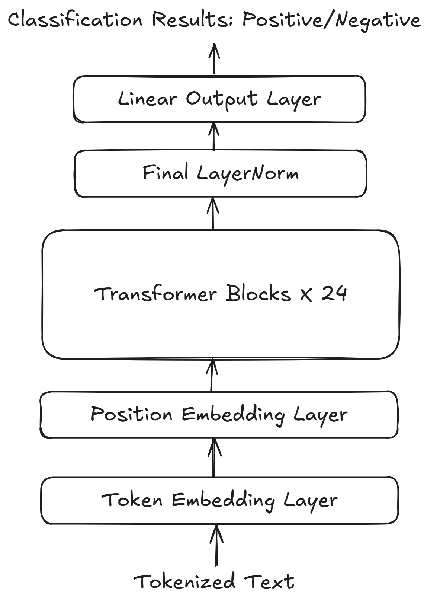

# EveLLM
EveLLM is a family of large language models (LLMs) derived from AdamLLM (see the [repository here](https://github.com/ElliotLeeLL/AdamLLM)). We are currently transitioning the EveLLM architecture from GPT to LLaMA. The family includes two models: **EveLLM Classifier**, optimized for film review classification, and **EveLLM Chat**, designed for instruction-following tasks.

## EveLLM Classifier

The **EveLLM Classifier** is a fine-tuned large language model based on GPT2-355M, specifically adapted for classification tasks. Its architecture is illustrated in Figure 1:

   
  <em>Figure 1: The Architecture of The EveLLM Classifier</em>

The model begins with two embedding layers, followed by 24 transformer blocks. The output from these components is passed through a final layer of normalization and a linear output layer. Notably, the linear output layer produces only 2 output features, as the classification task involves binary sentiment prediction (positive or negative). 

During the fine-tuning, only the final transformer block, the final layer norm, and the linear output layer are trainable — all other layers are frozen. This selective training strategy helps preserve the knowledge learned during pretraining while adapting the model efficiently to the classification task. 

## EveLLM Chat

EveLLM Chat is fine-tuned from GPT-2 (124M) and shares a similar architecture with EveLLM Classifier, with a key difference in the output layer: EveLLM Chat produces 50257 output features, corresponding to the full vocabulary size of the GPT-2 model. The architecture is illustrated in Figure 2:

   
  <em>Figure 1: The Architecture of The EveLLM Classifier</em>

Unlike EveLLM Classifier, EveLLM Chat does not freeze any layers during training and consists of only 12 transformer blocks, aligning with the original GPT-2 (124M) configuration.
